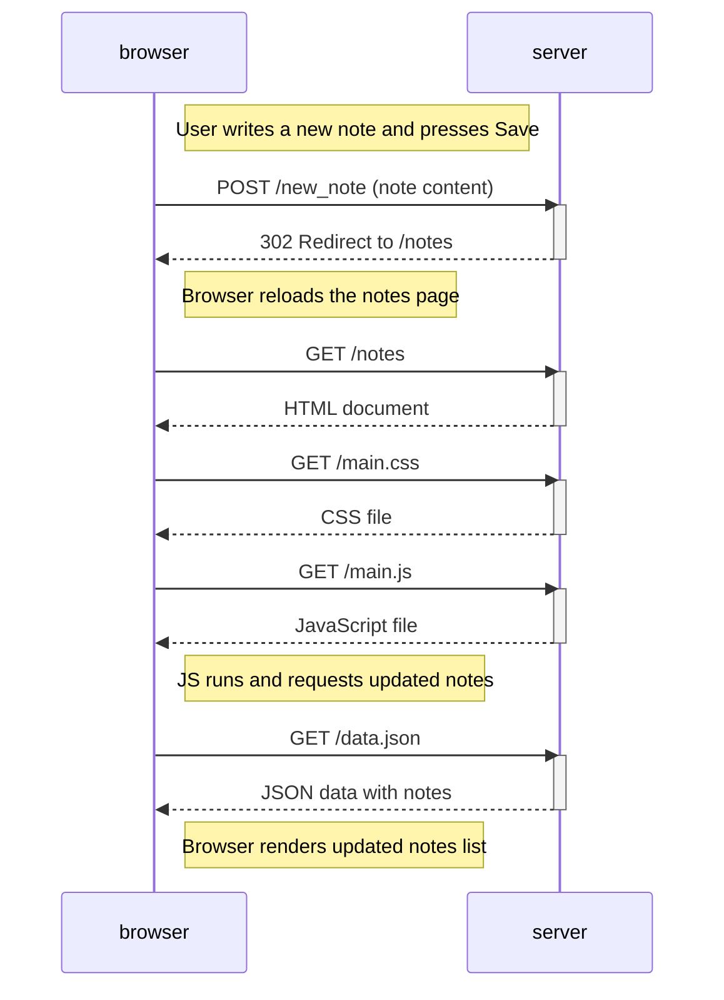

```mermaid

sequenceDiagram
    participant browser
    participant server

    Note right of browser: User writes a new note and presses Save

    browser->>server: POST /new_note (note content)
    activate server
    server-->>browser: 302 Redirect to /notes
    deactivate server

    Note right of browser: Browser reloads the notes page

    browser->>server: GET /notes
    activate server
    server-->>browser: HTML document
    deactivate server

    browser->>server: GET /main.css
    activate server
    server-->>browser: CSS file
    deactivate server

    browser->>server: GET /main.js
    activate server
    server-->>browser: JavaScript file
    deactivate server

    Note right of browser: JS runs and requests updated notes

    browser->>server: GET /data.json
    activate server
    server-->>browser: JSON data with notes
    deactivate server

    Note right of browser: Browser renders updated notes list
    
```