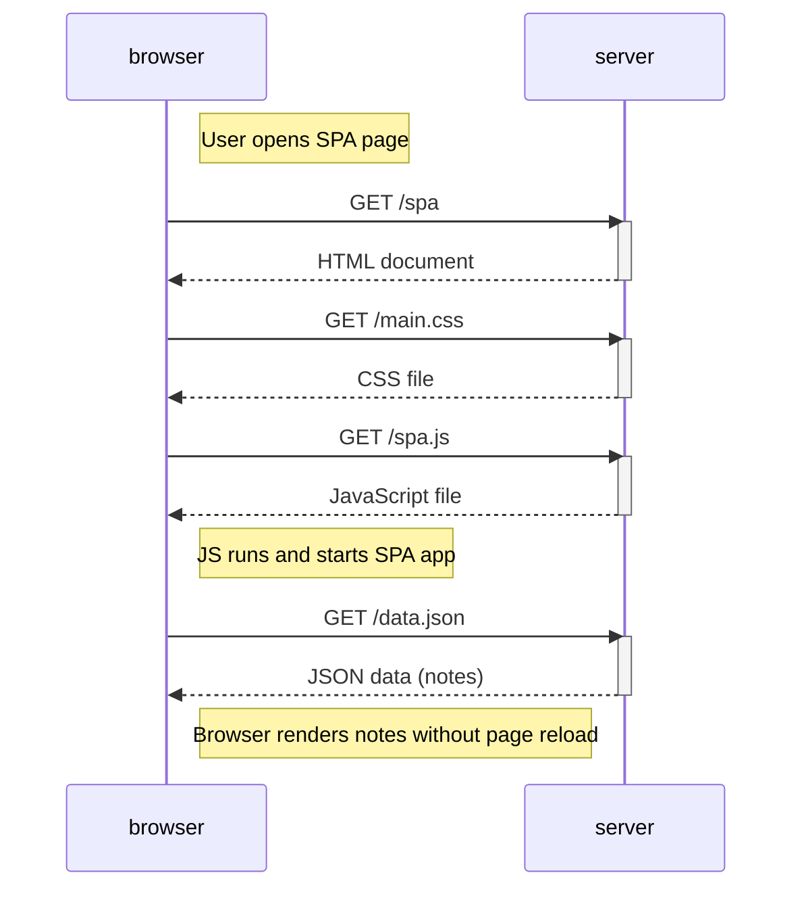

```mermaid
sequenceDiagram
    participant browser
    participant server

    Note right of browser: User opens SPA page

    browser->>server: GET /spa
    activate server
    server-->>browser: HTML document
    deactivate server

    browser->>server: GET /main.css
    activate server
    server-->>browser: CSS file
    deactivate server

    browser->>server: GET /spa.js
    activate server
    server-->>browser: JavaScript file
    deactivate server

    Note right of browser: JS runs and starts SPA app

    browser->>server: GET /data.json
    activate server
    server-->>browser: JSON data (notes)
    deactivate server

    Note right of browser: Browser renders notes without page reload
```